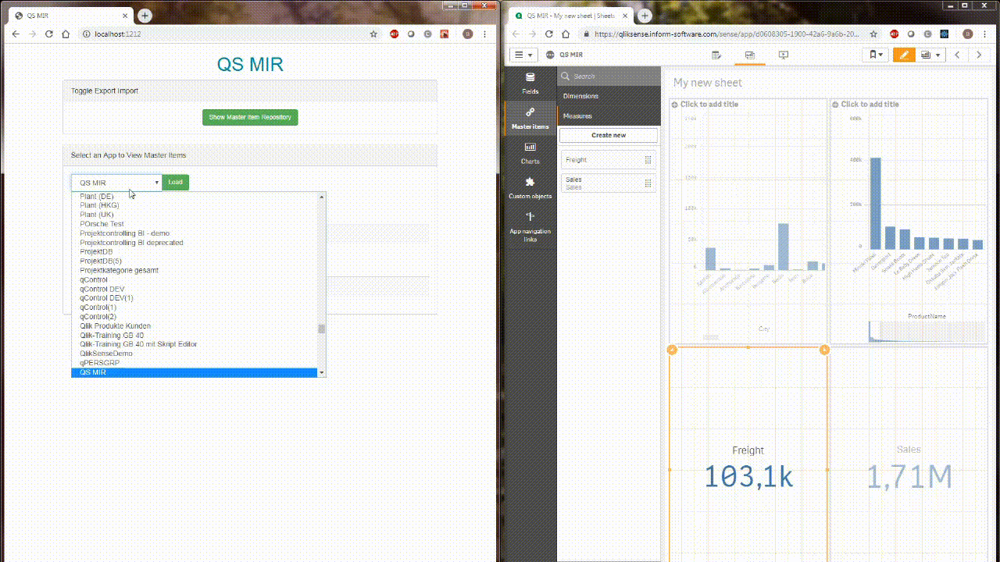
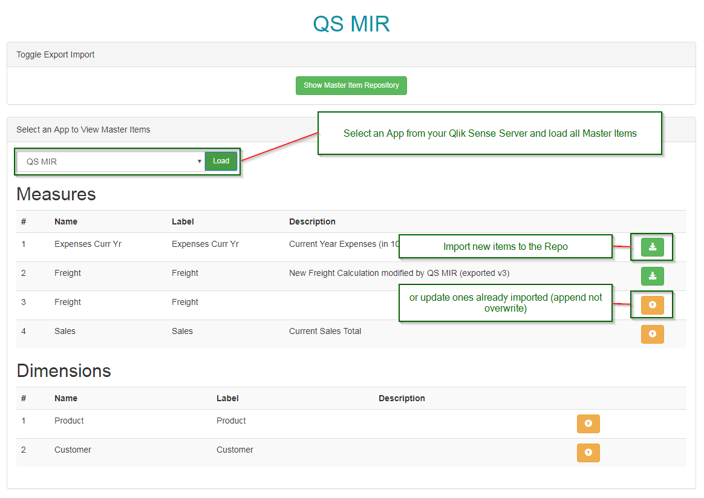
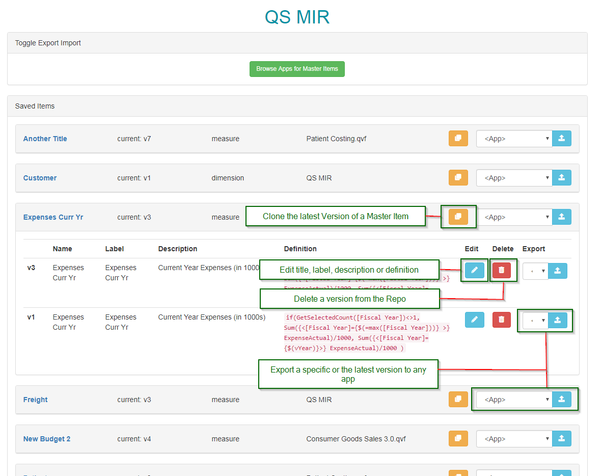

# Qlik Sense Master Item Repository

QS MIR is a web application written in JavaScript that should help Qlik Sense users manage their master items across their Qlik platform. The basic functionality allows users to:

* Connect to an app
* List, preview and extract master dimensions and measures 
* Manage (store, clone, edit or delete) these master items
* Export modified or original master items back to ANY app



## Technology

The entire solution has been created in JavaScript/Node.js using React.js for the front end, enigma.js for the Qlik platform communication, express for the API and sqlite for storage. 

## Compatibility

This has been tested with Qlik Sense Server and Desktop February and April 2019 - Since enigma has been available longer it might work with legacy versions. 

## Installation

To install QS MIR do the following:

0) Have node js installed :-)

1) Clone or Download this repository and unzip to a folder on your PC / Server

2) Open a command prompt and navigate to the project's folder you created in 1). Here, run ```npm install```

3) If you're running this with Qlik Sense Desktop, skip to step **8**. For Server continue with step **4**

4) To enable the backend to communicate with Qlik we need to export certificates through yor QMC (or via API) see [HERE](https://help.qlik.com/en-US/sense/April2019/Subsystems/ManagementConsole/Content/Sense_QMC/export-certificates.htm) to find out how. 

5) Copy the certificates to the following path in your project folder ```<Your project folder>/src/server/cert``` if it doesnt exist yet, create the subfolder.

6) Modify the config file stored in ```<Your project folder>/src/server/config/config.js```. (I wnat to have an admin layer in the future but this is it for now ;-))

```javascript
///src/server/config/config.js

// Webserver Config 

export var port = 1212; // Change this port if you don't like mine

// Qlik Sense Stuff

export var qlikCertificateDir = './src/server/cert/'; //change this if you want to take your certificates from elsewhere
export var qlikUser     = 'UserDirectory=INTERNAL;UserId=SA_API'; //Change this if you want to use another user then the standard API service account
export var qlikServer   = null; // Here enter the websocket address for your Qlik Sense Server engine
export var qlikIsSrv    = false; //change this to true if you're connecting to a QS server
```

7) Once you have certificates and config in place you should be ready to go and proceed with step **8**.

8) To start the webserver run ```npm run server``` in the command prompt from your project directory.

9) Open ```http://localhost:1212``` (or whatever port you used in the config above) in your browser and you should be good to go.

## Functionality

Use the button at the top to cycle between import and repository view

Import master items after choosng an app and pressing ```Load```


Manage and export master items from the repository view


## Known Issues

* When you use SA_API user with server, sometimes master items don't show for users. Use a real user from the directory in this case (app owner for example). In the future users will be able to choose which user they want to export for. Defaults to app owner or a window appears to provide user information

* When using Qlik Sense Desktop and you exported an item to an app while the same app is open in a window: You have to refresh the page for the element to show up. Do not save before hitting F5.

## Call for Support

If you're interested in contributing or collaborating on the project let me know. There are tons of ideas and possibilities and since I'm doing this in my free time I cannot possibly realise all of them :-)

## Ideas

* Add a management/settings view to handle connection and other properties
* Choose which user to export the ite for on server (get app owner via QRS)
* Validate expression syntax by choosing an app to validate in and then use API method. Could also validate before export to see if fields are available that are used
* Replace original master item when exporting and object is present - this should update all dependent objects (thanks [@dietler](https://twitter.com/dietler))
